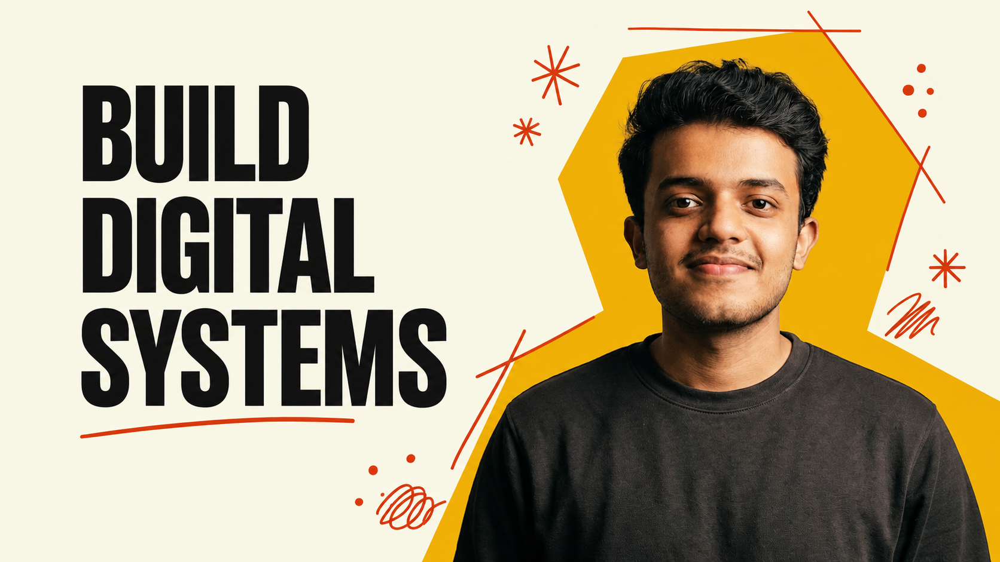

# KESAB MAHARANA

<p align="center">
  
</p>

<h3 align="center">
  Full-Stack Developer · AI Engineer · Builder
</h3>

<p align="center">
  I build full-stack products, AI-native applications, scalable systems,
  and interfaces where engineering meets visual craft.
</p>

<p align="center">
  <a href="YOUR_PORTFOLIO_URL">Portfolio</a>
  ·
  <a href="YOUR_GITHUB_URL">GitHub</a>
  ·
  <a href="YOUR_LINKEDIN_URL">LinkedIn</a>
</p>

---

## About

I'm **Kesab Maharana**, a Computer Science student and full-stack developer focused on building digital products, AI-native applications, and scalable systems.

I like working across the entire stack — from designing interfaces and interactive experiences to building APIs, databases, AI pipelines, distributed systems, and deployment infrastructure.

My philosophy:

> **Build. Ship. Learn. Repeat.**

---

## What I Build

```text
Full-Stack Products
AI-Native Applications
SaaS Platforms
Developer Tools
Real-Time Applications
Distributed Systems
Cloud-Native Infrastructure
Interactive Web Experiences